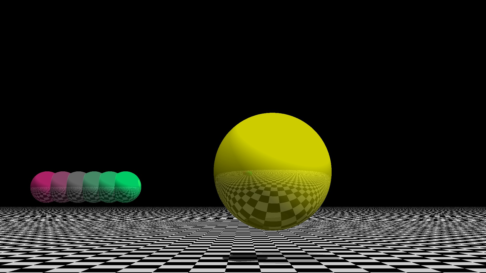

## Introduction

This is a small experiment where I rewrite [this Python code][1] in C++11. The goal is to get acquainted with an elementary C++ or what I would consider its minimal viable subset (if there is any) and to compare the result with the PyPy compiler.

## Results

CPython: __92.1s.__, 64.388 MB. 

C++11 (g++ -O3): __6.00s.__, 9.424 MB.

PyPy: __2.22s__, 114.224 MB.

Note: 1920x1080 resolution, intersection depth = 20, positive epsilon test with EPSILON = 0.00001. 

The C++ code could be improved to run faster, the results merely indicate that this is not a trivial task. Also notice that PyPy speeds up CPython nearly 50x times in this case, so Python is not generally slow, it is that we are stuck with CPython and the C/C++ wrapping paradigm.

See the ray tracing result below, compare it to [the one here.](https://pyperformance.readthedocs.io/)

<table>
<tr>
<th style="text-align:center"> Corrected Ray Tracing Result</th>
</tr>
<tr>
<td>

</td>
</tr>
</table>

See Appendix for various details and the corrections of the original Python code.

## Conclusion

I managed to rewrite the Python code manually in C++ and make it run slower than the jitted Python 3 code compiled with PyPy. I suspect this has something to do with the way I transformed recursions into a two stage iterative process, and that the Python code is part of the PyPy development tests. PyPy is amazing!

Then how come nobody uses it? Consider the main Python strength - its libraries, especially big unique projects such as:

1. John D. Hunter (R. I. P.) and Matplotlib.
2. Travis Oliphant and Numpy+Anaconda.
3. Theano, PyTorch, Keras... Jonas Matuzas' world record in MNIST digit classification (0.17%).
4. William Stein and SageMath. 20KLOC just the graph library alone, Khovanov homology etc.
5. Ton Roosendaal, the primary author of Blender, who chose Python as a scripting language for Blender.

Not to mention OpenGL. They all bind to C/C++, rely on CPython... Python also advances via CPython and PyPy will lag a few version numbers behind, this is no good. So this is Python and an excellent technology PyPy, yet still no traction. Imagine how hard it is out there for any new dynamic language which has none of these factors to begin with.

Regarding the C++ code, it can be made to run faster than PyPy, no doubt. The point of this report is to show that merely writing or rewriting code at higher level C++ with -O3 is on par with a JIT-compiled dynamic language. One needs experience and time to optimize C++ codes at lower levels in order to rip the benefits of C++.

## References

1. [https://github.com/python/pyperformance/blob/main/pyperformance/benchmarks/bm_raytrace.py][1]
2. [https://www.scratchapixel.com/lessons/3d-basic-rendering/minimal-ray-tracer-rendering-simple-shapes/ray-plane-and-ray-disk-intersection][2]

[1]: https://github.com/python/pyperformance/blob/main/pyperformance/benchmarks/bm_raytrace.py
[2]: https://www.scratchapixel.com/lessons/3d-basic-rendering/minimal-ray-tracer-rendering-simple-shapes/ray-plane-and-ray-disk-intersection

## Appendix

### Some Details

The actual program is a ray tracer that does not include refractions. For more complete educational ray tracers an interested reader is referred to ["smallpt" related codes](https://github.com/seifeddinedridi/smallvpt), Peter Shirley's et al. Ray Tracing Weekend Series, or even Physically Based Rendering: From Theory To Implementation by Matt Pharr, Wenzel Jakob, and Greg Humphreys.

The Python program creates heterogeneous containers at run-time. In order to emulate this type of programming, 
I have applied the STL vector of the C++11 shared pointers to the Base class from which all the geometric 
primitives are derived. This technique is known as "late binding" which uses virtual class functions and the public 
inheritance-based polymorphism. 

The ray-tracing recursions have been replaced here with a two-stage process: (i) the path generation, 
and (ii) the propagation of colors. 

### Installation

One must use at least the gcc-4.6.0 compiler (or a more recent version supporting C++11).
Simply run
```console
make
./premaxwell
```
It will create the image "out_cpp.ppm".

[To install PyPy](https://stackoverflow.com/questions/53266913/how-to-create-a-conda-environment-that-uses-pypy):
```console
conda config --set channel_priority strict
conda create -c conda-forge -n pypy pypy
conda activate pypy
```

The [Python code][1] is modified to remove all the pyperf testing clutter:
```Python
import time
...
start = time.perf_counter()
    Canvas = PpmCanvas
    #c = Canvas(320,240,'test_raytrace')
    c = Canvas(1920*1,1080*1,'out_pypy')
    s = Scene()
    s.addLight(Point(30, 30, 10))
    s.addLight(Point(-10, 100, 30))
    s.lookAt(Point(0, 3, 0))
    s.addObject(Sphere(Point(1,3,-10), 2), SimpleSurface(baseColour = (1,1,0)))
    for y in range(6):
        s.addObject(Sphere(Point(-3 - y * 0.4, 2.3, -5), 0.4),
                    SimpleSurface(baseColour = (y / 6.0, 1 - y / 6.0, 0.5)))
    s.addObject(Halfspace(Point(0,0,0), Vector.UP), CheckerboardSurface())
    s.render(c)
    c.save()
    time_elapsed = time.perf_counter() - start
    print(f"Time: {time_elapsed}")
```

The test is then performed with "python3 raytrace_mod.py" or [this approach](https://unix.stackexchange.com/questions/375889/unix-command-to-tell-how-much-ram-was-used-during-program-runtime):
```console
/usr/bin/time --verbose  python3 raytrace_mod.py
```
to test the memory usage.

### Some Minor Enhancements

The original Python code had a bug: its HalfSpace class did not calculate the intersection 
time correctly as it missed the necessary numerator, see [Ref. 2][2]:
```Python
class Halfspace:
    def __init__(self, point, normal):
        self.point = point
        self.normal = normal.normalized()

    def __repr__(self):
        return 'Halfspace(%s,%s)' % (repr(self.point), repr(self.normal))

    def intersectionTime(self, ray):
        
        #Twere was a BUG here:     
        #v = ray.vector.dot(self.normal)
        #if v:
        #    return 1 / -v
        #else:
        #    return None
        
        #Instead:
        v = ray.vector.dot(self.normal)
        diff = ray.point - self.point
        inner_prod = diff.dot(self.normal)
        if v:
            return inner_prod / -v
        else:
            return None

    def normalAt(self, p):
        return self.normal
```

The second enhancement concerns the line 217 in [the original code][1]:

__if candidateT is not None and candidateT > -EPSILON:__

It is better to change it to

__if candidateT is not None and candidateT > EPSILON:__

The execution time reduces 5x with no significant decrease of the image quality.


